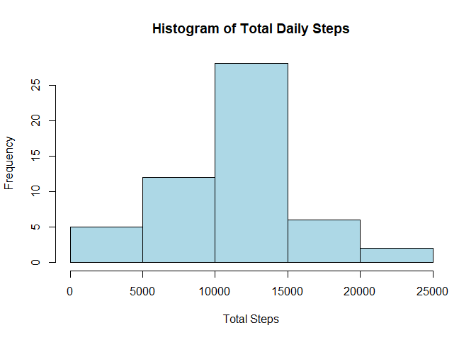
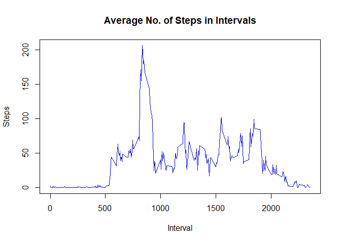
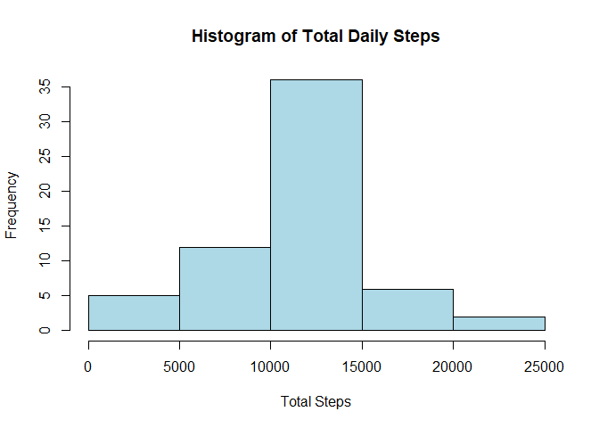
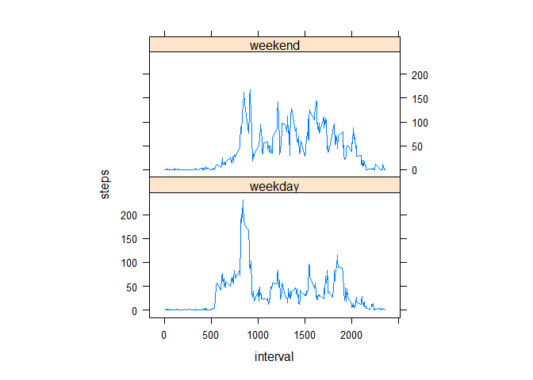

```r
# Download files from website
url <- "https://github.com/daparalleon18/RepData_PeerAssessment1/raw/master/activity.zip"
dir <- getwd()
destfile <- paste(dir, "activity.zip", sep = "/")
download.file(url, destfile)
# Unzip file
unzip(destfile)
```

## Loading and preprocessing the data

1. Load the data(i.e. read.csv())


```r
df <- read.csv('activity.csv')
summary(df)
```

```
##      steps            date              interval     
##  Min.   :  0.00   Length:17568       Min.   :   0.0  
##  1st Qu.:  0.00   Class :character   1st Qu.: 588.8  
##  Median :  0.00   Mode  :character   Median :1177.5  
##  Mean   : 37.38                      Mean   :1177.5  
##  3rd Qu.: 12.00                      3rd Qu.:1766.2  
##  Max.   :806.00                      Max.   :2355.0  
##  NA's   :2304
```

```r
str(df)
```

```
## 'data.frame':	17568 obs. of  3 variables:
##  $ steps   : int  NA NA NA NA NA NA NA NA NA NA ...
##  $ date    : chr  "2012-10-01" "2012-10-01" "2012-10-01" "2012-10-01" ...
##  $ interval: int  0 5 10 15 20 25 30 35 40 45 ...
```

2. Process/transform the data (if necessary) into a format suitable for your analysis


```r
# Transform date to "date" data type 
df$date <- as.Date(df$date)
str(df) 
```

```
## 'data.frame':	17568 obs. of  3 variables:
##  $ steps   : int  NA NA NA NA NA NA NA NA NA NA ...
##  $ date    : Date, format: "2012-10-01" "2012-10-01" ...
##  $ interval: int  0 5 10 15 20 25 30 35 40 45 ...
```

## What is mean total number of steps taken per day?
For this part of the assignment, you can ignore the missing values in the dataset.

1. Calculate the total number of steps taken per day


```r
df1 <- aggregate(steps ~ date, df, sum)
head(df1,10)
```

```
##          date steps
## 1  2012-10-02   126
## 2  2012-10-03 11352
## 3  2012-10-04 12116
## 4  2012-10-05 13294
## 5  2012-10-06 15420
## 6  2012-10-07 11015
## 7  2012-10-09 12811
## 8  2012-10-10  9900
## 9  2012-10-11 10304
## 10 2012-10-12 17382
```

2. If you do not understand the difference between a histogram and a barplot, research the difference between them. Make a histogram of the total number of steps taken each day


```r
hist(df1$steps, 
     main = "Histogram of Total Daily Steps",
     xlab = "Total Steps",
     col = "light blue")
```

<!-- -->

3.Calculate and report the mean and median of the total number of steps taken per day


```r
mean(df1$steps)
```

```
## [1] 10766.19
```

```r
median(df1$steps)
```

```
## [1] 10765
```


## What is the average daily activity pattern?

1. Make a time series plot (i.e. type = "l") of the 5-minute interval (x-axis) and the average number of steps taken, averaged across all days (y-axis)

```r
df2 <- aggregate(steps ~ interval, df, mean)
plot(df2$interval, 
     df2$steps, 
     type = "l",
     main = "Average No. of Steps in Intervals",
     xlab = "Interval",
     ylab = "Steps",
     col = "blue")
```

<!-- -->

2. Which 5-minute interval, on average across all the days in the dataset, contains the maximum number of steps?


```r
# Which 5-min interval, on average across all the days, contains the maximum number of steps
df2$interval[df2$steps == max(df2$steps)]
```

```
## [1] 835
```

## Imputing missing values

Note that there are a number of days/intervals where there are missing values (coded as NA). The presence of missing days may introduce bias into some calculations or summaries of the data.

1. Calculate and report the total number of missing values in the dataset (i.e. the total number of rows with NAs)


```r
colSums(is.na(df))
```

```
##    steps     date interval 
##     2304        0        0
```

2. Devise a strategy for filling in all of the missing values in the dataset. The strategy does not need to be sophisticated. For example, you could use the mean/median for that day, or the mean for that 5-minute interval, etc.


```r
agg_mean <- aggregate(steps ~ interval, df, mean)
df_clean <- merge(x = df, y = agg_mean, by = 'interval', all.x = TRUE)

df_clean["steps.x"][is.na(df_clean["steps.x"])] <- df_clean["steps.y"][is.na(df_clean["steps.x"])]
head(df_clean, 10)
```

```
##    interval  steps.x       date  steps.y
## 1         0 1.716981 2012-10-01 1.716981
## 2         0 0.000000 2012-11-23 1.716981
## 3         0 0.000000 2012-10-28 1.716981
## 4         0 0.000000 2012-11-06 1.716981
## 5         0 0.000000 2012-11-24 1.716981
## 6         0 0.000000 2012-11-15 1.716981
## 7         0 0.000000 2012-10-20 1.716981
## 8         0 0.000000 2012-11-16 1.716981
## 9         0 0.000000 2012-11-07 1.716981
## 10        0 0.000000 2012-11-25 1.716981
```

3. Create a new dataset that is equal to the original dataset but with the missing data filled in.


```r
df_clean <- df_clean[,c('steps.x', 'date', 'interval')]
names(df_clean) <- c('steps', 'date', 'interval')
df_clean <- df_clean[order(df_clean$date, df_clean$interval),]
head(df_clean, 10)
```

```
##         steps       date interval
## 1   1.7169811 2012-10-01        0
## 63  0.3396226 2012-10-01        5
## 128 0.1320755 2012-10-01       10
## 205 0.1509434 2012-10-01       15
## 264 0.0754717 2012-10-01       20
## 327 2.0943396 2012-10-01       25
## 376 0.5283019 2012-10-01       30
## 481 0.8679245 2012-10-01       35
## 495 0.0000000 2012-10-01       40
## 552 1.4716981 2012-10-01       45
```

```r
colSums(is.na(df_clean))
```

```
##    steps     date interval 
##        0        0        0
```

4. Make a histogram of the total number of steps taken each day and Calculate and report the mean and median total number of steps taken per day. Do these values differ from the estimates from the first part of the assignment? What is the impact of imputing missing data on the estimates of the total daily number of steps?


```r
# Calculate the total number of steps taken per day
df3 <- aggregate(steps ~ date, df_clean, sum)

# Make a histogram of the total number of steps taken each day
hist(df3$steps, 
     main = "Histogram of Total Daily Steps",
     xlab = "Total Steps",
     col = "light blue")
```

<!-- -->

```r
# Calculate and report the mean and median of the total number of steps taken per day
mean(df3$steps)
```

```
## [1] 10766.19
```

```r
median(df3$steps)
```

```
## [1] 10766.19
```
Mean did not change but median did by a small amount.

## Are there differences in activity patterns between weekdays and weekends?

For this part the weekdays() function may be of some help here. Use the dataset with the filled-in missing values for this part.

1. Create a new factor variable in the dataset with two levels – “weekday” and “weekend” indicating whether a given date is a weekday or weekend day.


```r
weekday_tag <- function(x) {
  if (weekdays(x) %in% c("Sunday", "Saturday")) {
    "weekend"
  } else {
    "weekday"
  }
}
df_clean$weekday <- sapply(df_clean$date, weekday_tag)
head(df_clean,10)
```

```
##         steps       date interval weekday
## 1   1.7169811 2012-10-01        0 weekday
## 63  0.3396226 2012-10-01        5 weekday
## 128 0.1320755 2012-10-01       10 weekday
## 205 0.1509434 2012-10-01       15 weekday
## 264 0.0754717 2012-10-01       20 weekday
## 327 2.0943396 2012-10-01       25 weekday
## 376 0.5283019 2012-10-01       30 weekday
## 481 0.8679245 2012-10-01       35 weekday
## 495 0.0000000 2012-10-01       40 weekday
## 552 1.4716981 2012-10-01       45 weekday
```

2. Make a panel plot containing a time series plot (i.e. type = "l") of the 5-minute interval (x-axis) and the average number of steps taken, averaged across all weekday days or weekend days (y-axis). See the README file in the GitHub repository to see an example of what this plot should look like using simulated data.


```r
library(lattice)
df4 <- aggregate(steps ~ interval + weekday, df_clean, mean)
xyplot(steps ~ interval | weekday, df4, aspect = 1/2, type = "l")
```

<!-- -->
